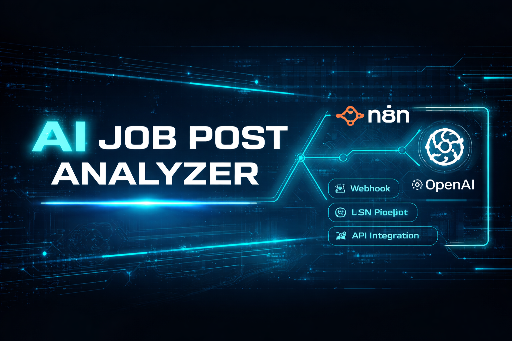
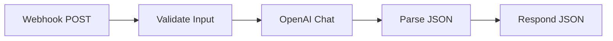

<p align="center">
  
</p>

<br>

# AI Job Post Analyzer (n8n + OpenAI)

## Overview

This project demonstrates an AI-powered webhook microservice built using **n8n** and **OpenAI (gpt-4o-mini)**.

It accepts a raw job description and returns structured, validated JSON including:

- Title guess
- Seniority level
- Extracted key skills
- Summary bullets
- Suggested interview questions

---

## Architecture




---

## Run Locally

1. Import `workflow.json` into n8n.
2. Add your OpenAI credentials.
3. Execute the workflow (listening mode).
4. Send the example request:

```powershell
Invoke-RestMethod -Method Post `
  -Uri "http://localhost:5678/webhook-test/test-user" `
  -ContentType "application/json" `
  -Body (Get-Content .\example_request.json -Raw)
```

---

## Why This Matters

This demonstrates production-style LLM automation:

validated inputs → structured JSON prompting → safe parsing → API-ready responses.
